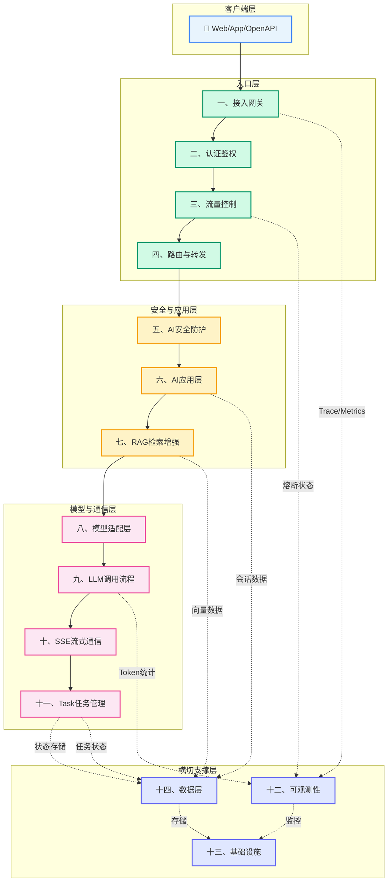

# MOC-架构蓝图

AI应用平台架构索引，每个模块指向详细笔记。

## v2架构总览

基于平台架构视角，涵盖15个核心模块：

### 入口层
- [[1-接入网关]] — 统一API入口，处理认证、限流、路由
- [[2-认证鉴权]] — 身份认证、Token管理、权限校验
- [[3-流量控制]] — 限流、并发限制、配额、熔断
- [[4-路由与转发]] — URL匹配、服务发现、请求转发

### 安全与应用层
- [[5-AI安全防护]] — 输入安全、输出安全、内容审核
- [[6-AI应用层]] — Chat Service、Agent Runtime、Memory
- [[7-RAG检索增强生成]] — 文档处理、Embedding、向量检索

### 模型与通信层
- [[8-模型适配层]] — 统一接口、参数归一化、多模型适配
- [[9-LLM调用流程]] — 用户输入、Prompt构建、模型调用
- [[10-SSE流式通信]] — 流式输出、WebFlux、长连接管理
- [[11-Task任务管理]] — 任务生命周期、状态管理

### 横切与支撑层
- [[12-可观测性]] — Trace、Metrics、Logging
- [[13-基础设施]] — Kubernetes、网络、高可用
- [[14-数据层]] — MySQL、Redis、向量数据库
- [[15-完整请求链路]] — 端到端流程图

## 核心设计理念

系统采用**分层架构**和**管道模式**设计，将AI应用的核心处理流程分解为线性流转的模块，同时通过共享上下文层和横切关注点提供统一支持。

## 数据流说明

```
用户请求 → 接入网关 → 认证鉴权 → 流量控制 → 路由与转发
            → AI安全防护 → AI应用层 → RAG检索增强生成
            → 模型适配层 → LLM调用 → SSE流式输出
            → Task任务管理 → 数据层持久化
```

## 模块关系总览

| 层级 | 模块 | 核心职责 |
|------|------|---------|
| 入口层 | 接入网关 | 统一API入口 |
| 入口层 | 认证鉴权 | 用户身份验证 |
| 入口层 | 流量控制 | 系统保护 |
| 入口层 | 路由与转发 | 请求分发 |
| 安全层 | AI安全防护 | 输入输出安全 |
| 应用层 | AI应用层 | 业务逻辑处理 |
| 应用层 | RAG检索增强生成 | 知识检索 |
| 模型层 | 模型适配层 | 多模型适配 |
| 模型层 | LLM调用流程 | 模型调用 |
| 通信层 | SSE流式通信 | 实时推送 |
| 通信层 | Task任务管理 | 任务状态 |
| 横切层 | 可观测性 | 监控追踪 |
| 支撑层 | 基础设施 | 部署运行 |
| 支撑层 | 数据层 | 数据存储 |
| 全景 | 完整请求链路 | 端到端流程 |

## 可视化架构图



## 关联迭代版本

- [[v0.1-统一接入网关]] — 进行中：协议转换、流式SSE、路由、限流熔断、认证鉴权
- [[v0.2-前置过滤链]] — 计划中：敏感词过滤、提示注入防御

## 可视化入口

- [[总体架构图]] — 系统总体架构图
- [[AI应用开发学习]] — 学习思维导图